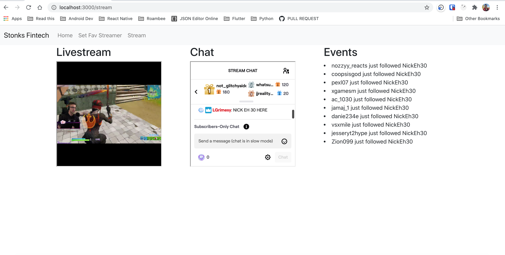

# Twitch Experiments
Here you will find a simple Express web app illustrating how to authenticate Twitch API calls using the OAuth authorization code flow.  This sample uses [Express](http://expressjs.com/), [Passport](http://passportjs.org/) for the server and [ReactJS](https://reactjs.org/) for the client.



## Installation
1. After you have cloned this repository, use [npm](https://www.npmjs.com/) to install dependencies on the backend.

```sh
$ npm install
```
2. `cd` to the client folder
```sh
$ cd client
```
3. Use `yarn` to install dependencies
```sh
$ yarn add
```

## Usage Server
Before running this sample, you will need to set four configuration fields at the top of index.js:

1. TWITCH_CLIENT_ID - This is the Client ID of your registered application.  You can register a new application at [https://dev.twitch.tv/dashboard/apps]
2. TWITCH_CLIENT_SECRET - This is the secret generated for you when you register your application, do not share this. In a production environment, it is STRONGLY recommended that you do not store application secrets on your file system or in your source code.
3. SESSION_SECRET -  This is the secret Express session middleware uses to sign the session ID cookie.
4. CALLBACK_URL - This is the callback URL you supply when you register your application.  To run this sample locally use [http://localhost:3000/auth/twitch/callback]

Optionally, you may modify the requested scopes when the /auth/twitch route is defined.

After setting these fields, you may run the server.

```sh
$ node index.js
```

## Usage Client
Before running the client, you need to set the two configuration fields in the `.env` file. 

1. REACT_APP_TWITCH_CLIENT_ID - Your Twitch Client ID
2. REACT_APP_SERVER_BASE_URL - Base URL for your server. To test locally you may use [http://localhost:4000]

After setting these fields, you may run the server

```sh
$ npm start
```

## Next Steps


## License

Copyright 2017 Amazon.com, Inc. or its affiliates. All Rights Reserved.

Licensed under the Apache License, Version 2.0 (the "License"). You may not use this file except in compliance with the License. A copy of the License is located at

    http://aws.amazon.com/apache2.0/

or in the "license" file accompanying this file. This file is distributed on an "AS IS" BASIS, WITHOUT WARRANTIES OR CONDITIONS OF ANY KIND, either express or implied. See the License for the specific language governing permissions and limitations under the License. 
